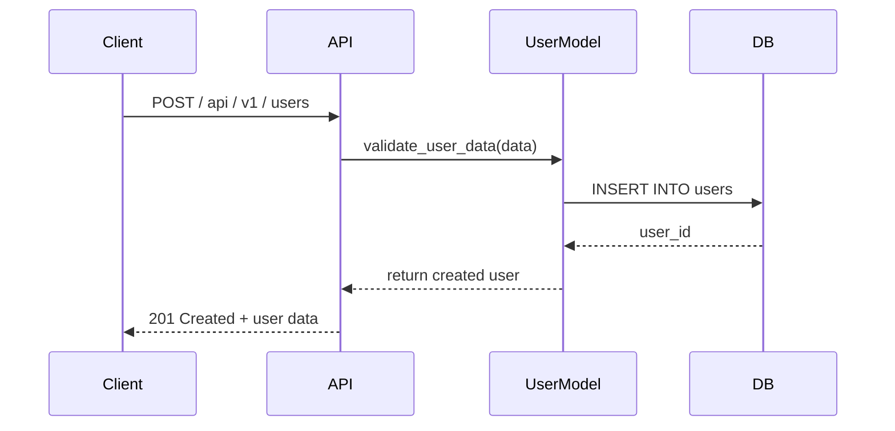
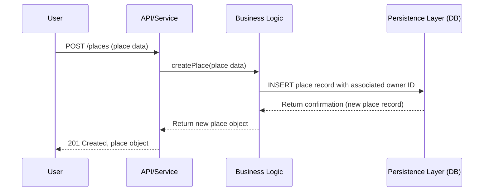
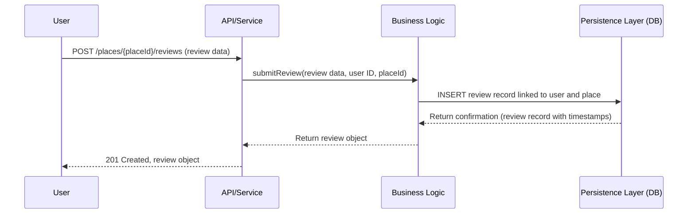
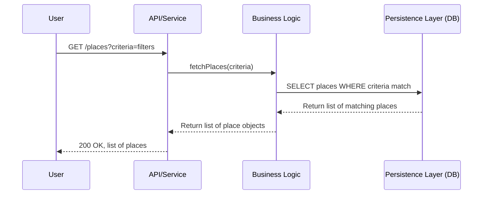

<h1 align="center">Technical Architecture Document</h1>

<p align="center">
  
</p>

## Summary:
- [Introduction](#1-introduction)
- [Architecture](#2-architecture)
- [Business Logic Layer](#3-business-logic-layer)
- [API Interaction](#4-api-interaction)
    - [User Registration](#41-user-registration)
    - [Place Creation](#42-place-creation)
    - [Review](#43-review)
    - [Fetching Place Listings](#44-fetching-place-listings)
- [Conclusion](#5-conclusion)

## 1. Introduction

The HBnB project is a web app that lets users list, find, and book places to stay. It’s built in layers to keep the system organized, easy to update, and scalable.

This document explains how the system is designed and how its parts work together. It’s meant to help guide the development process.

It includes:
- A general diagram showing the system’s structure.
- A detailed diagram of the business logic (how the app’s rules work).
- Step-by-step diagrams for key actions like user signup, creating a listing, writing a review, and browsing available places.

## 2. Architecture

### Package Diagram


  
The package diagram illustrates the overall structure of the HBnB system, highlighting the division of responsibilities across the Presentation Layer, Business Logic Layer, and Persistence Layer.

- **Presentation Layer:** Interfaces for user interactions via RESTful APIs.
- **Business Logic Layer (BLL):** Core processing, validation, and application rules.
- **Persistence Layer:** Interfaces with the data storage system (e.g., database).

## 3. Business Logic Layer

### Class Diagram

````mermaid
classDiagram
    class BaseModel {
        +id : UUID
        +createdAt : Date
        +updatedAt : Date
        +save
        +delete
    }

    class User {
        +firstName : String
        +lastName : String
        +email : String
        +password : String
        +createUser
        +updateUser
        +deleteUser
        +authenticate
    }

    class Place {
        +userId : UUID
        +name : String
        +description : String
        +createPlace
        +updatePlace
        +deletePlace
        +searchPlace
    }

    class Review {
        +userId : UUID
        +placeId : UUID
        +text : String
        +createReview
        +updateReview
        +deleteReview
        +validateReview
    }

    class Amenity {
        +name : String
        +createAmenity
        +updateAmenity
        +deleteAmenity
    }

    BaseModel <|-- User
    BaseModel <|-- Place
    BaseModel <|-- Review
    BaseModel <|-- Amenity

    User --> "*" Place : creates
    Place --> "*" Review : has
    User --> "*" Review : writes
    Place --> "*" Amenity : includes
    Amenity --> "*" Place
````
The class diagram provides an in-depth view of the Business Logic Layer, detailing the core entities and their interrelationships.


- `User`: Handles authentication and account management.
- `Place`: Represents an accommodation listing.
- `Review`: Captures user feedback on listings.
- `Amenity`: Lists features available in a Place.
- `PlaceService`, `UserService`, `ReviewService`: Encapsulate business logic operations.


- Entities are modeled with clear relationships (e.g., `User` has many `Places`; `Place` has many `Reviews`).
- Services abstract business rules and allow for future enhancements without modifying the core models.

## 4. API Interaction

### Sequence Diagrams

#### 4.1 User Registration



Illustrates how a new user registers through the system.

1. Client submits registration details to API.
2. API controller validates input and calls `UserService`.
3. `UserService` applies business rules and calls `UserRepository`.
4. User is saved to the database, response is returned.

#### 4.2 Place Creation



Shows the flow for adding a new accommodation listing.

1. Authenticated user submits place data.
2. `PlaceController` delegates to `PlaceService`.
3. Business rules applied, persisted via `PlaceRepository`.

#### 4.3 Review



Demonstrates how a review is created for a place.

1. User submits review through API.
2. `ReviewController` validates and calls `ReviewService`.
3. Review is saved, and aggregate ratings may be updated.

#### 4.4 Fetching Place Listings



Outlines how places are retrieved and returned to the client.

1. Client requests list of places.
2. `PlaceController` queries `PlaceService`.
3. Service aggregates data (e.g., amenities, reviews) and returns it.

**Design for All Sequence Diagrams:**
- Clear separation of responsibilities across controller, service, and repository layers.
- Emphasis on validation and business logic enforcement.
- Consistent interaction patterns improve maintainability.

---

## 5. Conclusion

This technical document serves as a foundational reference for implementing the HBnB system. Each diagram and accompanying explanation outlines critical architectural decisions and interactions that define the system’s behavior. By adhering to the structures and flows described herein, developers can ensure a robust, scalable, and maintainable implementation aligned with the project’s goals.
